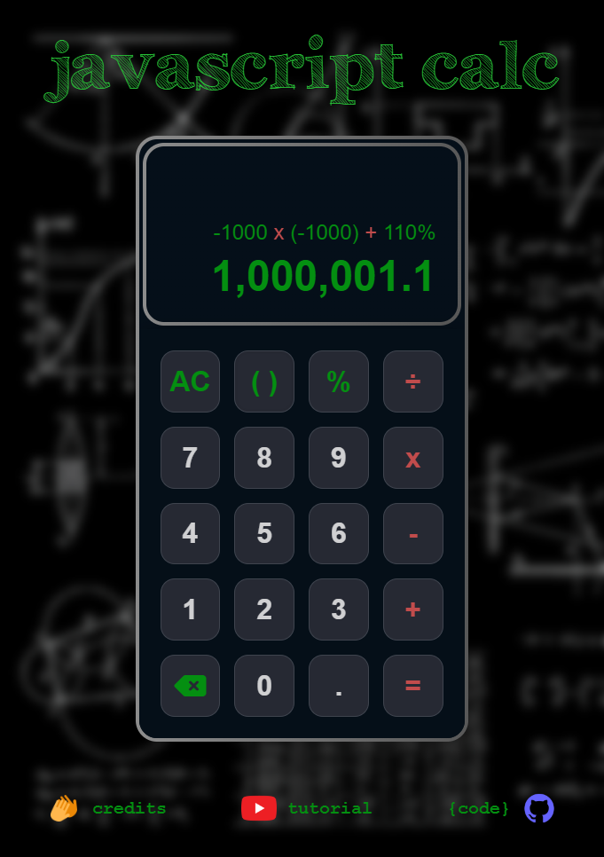
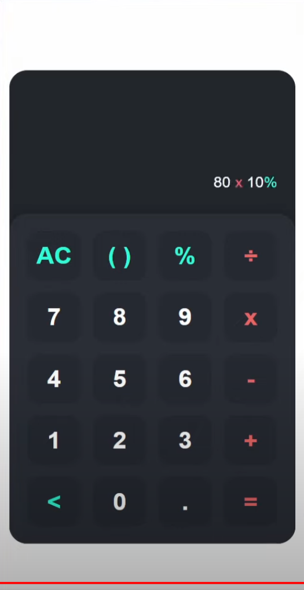

# calculator
<!-- Building a simple calculator with HTML, CSS &amp; JavaScript -->
[Build a Calculator App in HTML, CSS & JavaScript 2022](https://www.youtube.com/watch?v=_x8mNUBhLSk) by [Tyler Potts](https://www.youtube.com/@TylerPotts)  

Tyler's video caught my eye as a quick fun exercise to try out a few things, but I ended up spending quite a bit of time on it and taking things a bit further.

Amongst other things, I did some subtle restyling of the calculator, refined the input/output formatting.  
I went down the rabbit hole with the code behind, hammering out input validation and refining parts of the logic.
There were some tricky problems like how to support negative numbers without adding a +/- key, and catching edge cases like infinity and numbers expressed with exponential notation.  
JavaScript can do a pretty bad job of evaluating some expressions.  
e.g.  
* .3 x 10 = 3
* .3 ÷ .1 = 2.9999999999999996

<!--  -->
   

# credits  
[Tutorial: Build a Calculator App in HTML, CSS & JavaScript 2022](https://www.youtube.com/watch?v=_x8mNUBhLSk) by [Tyler Potts](https://www.youtube.com/@TylerPotts)  

 [Background art](https://unsplash.com/photos/h3kuhYUCE9A) by [Dan Cristian Pădureț](https://unsplash.com/@dancristianpaduret)  

 [Calculator favicon](https://icons8.com/icon/12780/calculator) from [icons8.com](https://icons8.com/)  

 [YouTube icon](https://www.iconfinder.com/icons/1298778/youtube_play_video_icon) from [iconfinder.com](https://www.iconfinder.com/)  

 [Applause icon](https://icons8.com/icon/12802/applause) from [icons8.com](https://icons8.com/)  

 [GitHub icon](https://www.iconfinder.com/icons/8725822) from [iconfinder.com](https://www.iconfinder.com/)  

